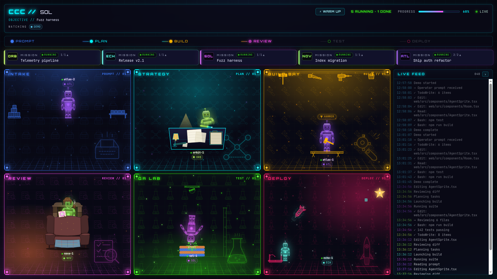
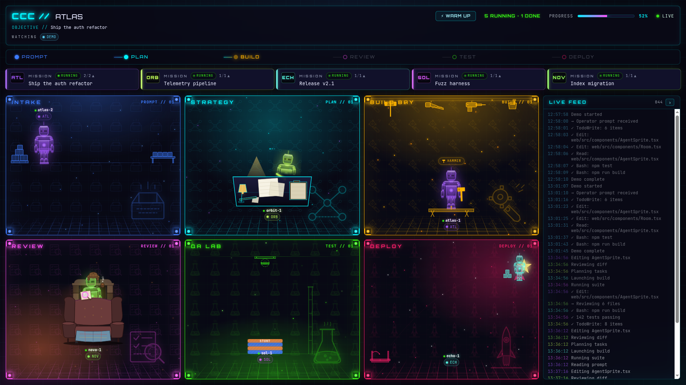
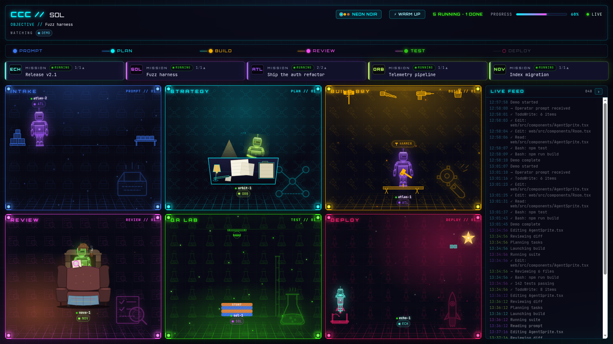
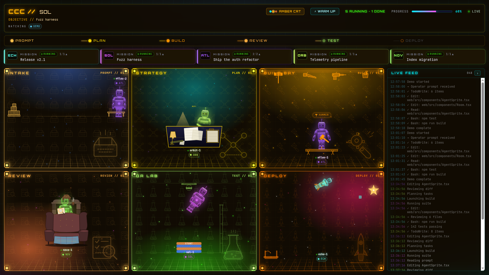
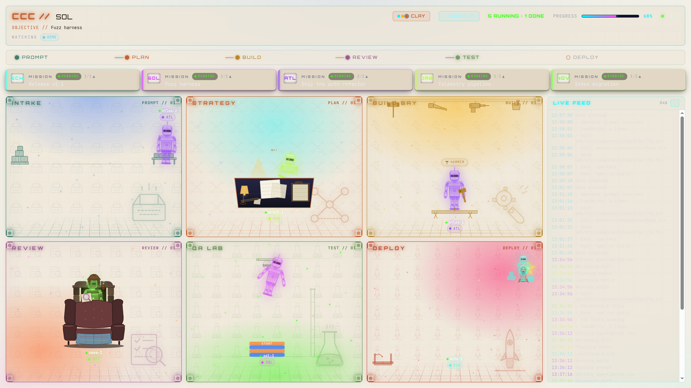

# Claude Command Central

Live mission-control dashboard for Claude Code sessions.



> Six theatrical rooms, one per workflow phase. Agents appear, walk, build, review, stunt-fall, and launch as your Claude Code sessions progress — in real time.

<details>
<summary>More views</summary>



</details>

---

## What is this?

Claude Command Central (`ccc`) is a real-time observability dashboard for agentic coding sessions. It tails structured events emitted by Claude Code hooks and renders them as a live 2D "command office" — six rooms, one per workflow phase, with animated agent figures moving through them as work progresses.

It exists because Claude Code routinely spawns parallel subagents across multiple projects, and watching a stream of raw tool calls gives you no spatial sense of where the work is or how far along it is. CCC converts that invisible execution into a glanceable operational view: which agents are active, which room they are working in right now, and what the overall mission progress looks like.

The dashboard runs entirely on your local machine, reads append-only JSONL feed files, and never writes back to the project it is observing.

---

## Themes

CCC ships **switchable visual themes** — pick one from the top bar; your choice persists. See [`DESIGN.md`](DESIGN.md) for the theme architecture.

| Neon Noir *(default)* | Amber CRT | Clay |
| :---: | :---: | :---: |
|  |  |  |
| Cyberpunk control room | Retro phosphor terminal | Warm editorial light |

---

## Features

**Six theatrical rooms, one per workflow phase:**

- **Intake** — agents carry prompt trays along lanes to the receiving table; this is where sessions begin.
- **Strategy** — agents sit at planners' desks under warm lamps; pen-sweep and ponder cycle while plans are mapped.
- **Build Bay** — each agent is hash-assigned a tool (hammer, saw, drill, or paint); a tool rack lines the back wall.
- **Review** — Sherlock mode: a wingback armchair, a fireplace, a deerstalker, magnifier and pipe with curling smoke.
- **QA Lab** — agents stunt-fall from a ceiling hatch into a safety-cushion stack: splash, sprawl, stand, thumbs-up.
- **Deploy** — a launch pad, a parabolic rocket arc to a pulsing star, a cargo box offloaded; the stack grows with each run.

**Visual design (humanoid + room revamp, three passes):**

- **Status-aware sprite chrome** — the visor shows a different HUD per status: active scan beam, done checkmark with halo, error red bars + bold `!`, idle pulsing center eye. Lit-from-above rim gradient on helmet/shoulders/limbs. Soft ground shadow under the boots, slow breathing scaleY when resting, subtle joint highlights, vent slats on the helmet, diagonal chest seams.
- **Per-room atmospherics** — every scene has a perspective floor grid, a phase-anchored volumetric light wash (REVIEW glows from the lower-left fireplace, STRATEGY from the top lamp, DEPLOY from the upper-right star, etc.), and ambient particles tuned per phase (PROMPT dust drift, PLAN thought sparks rising, BUILD welder sparks, REVIEW embers, TEST bubbles, DEPLOY twinkling starfield). Pointer-events disabled on the whole stack so it never blocks scene chrome.
- **Distinct rest poses + motion polish** — done agents settle into a stand-down arms-rotated pose with cubic-bezier overshoot; error agents physically slump (head + body tilt forward 14–20°). INTAKE walking gait adds vertical bob on each step + tilt at the lane endpoints. BUILD has secondary motion: head dips on hammer impact and shoulders counter-rotate so the body feels weighted instead of rigid. Hand-tuned cubic-bezier easing across the loop keyframes.

**Additional capabilities:**

- **Per-project Mission Strip** — a band of mission cards below the pipeline showing each wired project's current objective plus its live / total agent count.
- **Subagent team visibility** — every Claude Code subagent gets its own agent card, routed to the right room based on its role name (`*-reviewer` → Review, `*-test*` → QA Lab, `*-architect` → Strategy, etc.).
- **Resizable, collapsible Live Feed** — drag the left edge to widen or narrow; click `›` to collapse to a thin rail; width and collapse state persist in `localStorage`.
- **Humanized task text** — bash commands and tool calls are translated to plain English in the room thought bubbles (e.g. `npm test` → "Running tests", `git commit` → "Committing"); raw text is preserved in the Live Feed.
- **Project-colored agents** — each project's agents wear a consistent color derived from the project slug (short codes like `CCC`, `GB`, `DL`).
- **Occupancy lamps** — four corner lamps in each room glow only when at least one active agent is present; they fade when the room is empty or all agents are resting.
- **Resting-agent dim state** — `done`/`idle` agents lose their glow and animation loops so finished teammates read clearly as inactive.
- **Multi-project simultaneous observation** — a single `ccc serve` instance streams events from all registered projects at once; the registry auto-discovers new projects within five seconds of `ccc init`.
- **Warm-up demo** — one click in the dashboard runs a demo agent through every room sequentially so you can verify animations and lamp cycling without a real session.
- **Hook debug sidecar** — set `CCC_HOOK_DEBUG=1` to tee raw hook payloads to `~/.claude-command-central/hook-debug.jsonl` for investigation without affecting the main feed.

---

## Requirements

- **Node 20+**
- **Claude Code** installed and used as your coding-session runner
- **Linux, macOS, or WSL2** (Windows native is untested)

---

## Install

### Step 1 — Clone and build

```bash
git clone https://github.com/yourusername/claude-command-central.git
cd claude-command-central
npm install
npm run build
npm link
```

`npm link` makes the `ccc` command available globally from the built `dist/bin.js`.

### Step 2 — Wire each project you want to observe

Run this once inside every project directory you work in with Claude Code:

```bash
cd ~/your-project
ccc init
```

This installs Claude Code hooks into `.claude/settings.json` and registers the project in `~/.claude-command-central/projects.json`. It is idempotent — safe to re-run.

### Step 3 — Open the dashboard

```bash
ccc serve
```

Then open [http://localhost:7777](http://localhost:7777) in your browser. Start a Claude Code session in any wired project and watch the agents appear.

---

## How it works

```
Claude Code session
        │
        │  fires hooks on every tool call / session event
        ▼
 .claude/settings.json  (hooks installed by `ccc init`)
        │
        │  each hook runs:
        │  ccc emit --from-hook <HookName> --project <slug> --feed <path>
        ▼
 ~/.claude-command-central/feeds/<project>.jsonl
        │
        │  append-only JSONL — one event per line
        ▼
 ccc serve  (Fastify SSE server)  <--  polls registry for new projects
        │
        │  streams events over Server-Sent Events
        ▼
 http://localhost:7777  (Vite + React + framer-motion web dashboard)
```

The dashboard is read-only with respect to the project. The hook is the only write path, and it only writes to the CCC feed file, never to project source. On mount (and on every page refresh), the browser fetches `GET /api/snapshot` to hydrate the full current state before subscribing to the SSE stream, so the office is populated immediately rather than waiting for the next event.

Alternatively, `ccc watch` renders the same data as an Ink TUI directly in your terminal without a browser.

---

## Commands

| Command | Description |
|---------|-------------|
| `ccc init` | Wire the current directory to the dashboard. Installs Claude Code hooks and registers the project in `~/.claude-command-central/projects.json`. |
| `ccc serve` | Start the web dashboard on `localhost:7777`. Auto-discovers all registered projects; hot-reloads when new projects are added. |
| `ccc watch` | Render the Ink TUI dashboard in the terminal. Requires explicit `--feed` path(s). |
| `ccc emit` | Append a single event to a feed from the command line. Supports `flow`, `agent`, and `log` event types. |
| `ccc demo` | Drive a demo agent through all six phases in the dashboard at configurable speed. |

### Flag reference

**`ccc init`**

```
--project <slug>      Override project slug (default: directory name)
--local               Store the feed inside the project at .claude/feeds/
--ccc-command <cmd>   Command used in hook entries (default: "ccc")
--dry-run             Print what would be written without changing anything
```

**`ccc serve`**

```
--port <n>            Port to listen on (default: 7777)
--host <addr>         Interface to bind (default: 127.0.0.1)
--feed <path...>      Explicit feed path(s). Skips registry when given.
--project <slug>      Label for a single --feed path
```

**`ccc watch`**

```
--feed <path...>      One or more JSONL feed paths (required)
--project <name>      Label when a single --feed is given
```

**`ccc emit`**

```
--feed <path>         Target JSONL feed path (required)
--type <type>         flow | agent | log
--agent <name>        Agent name (agent events)
--phase <phase>       Phase name (PROMPT | PLAN | BUILD | REVIEW | TEST | DEPLOY)
--status <status>     idle | active | blocked | done | error
--task <text>         Task description string
--title <text>        Flow title
--objective <text>    Flow objective
--progress <n>        Overall progress 0-100
--message <text>      Narrative message (also appended to Live Feed)
--project <slug>      Project slug stamped on the event
--from-hook <name>    Read Claude Code hook JSON from stdin and translate it
```

**`ccc demo`**

```
--feed <path>         Feed path (defaults to first registered project)
--project <slug>      Project label shown in the UI (default: "demo")
--reset               Clear the feed before replaying
--speed <seconds>     Seconds between steps (default: 1.5)
```

---

## Multi-project setup

Each project you want to observe gets its own `ccc init`:

```bash
cd ~/project-alpha && ccc init
cd ~/project-beta  && ccc init
cd ~/project-gamma && ccc init
```

All three are now registered in `~/.claude-command-central/projects.json`. A single `ccc serve` instance discovers all of them automatically and streams their events into the same dashboard. Each project gets a color-coded chip in the Live Feed and its own Mission Strip card.

The registry file format is plain JSON; you can inspect or edit it by hand:

```
~/.claude-command-central/
├── projects.json         <- project registry (slug, path, feed, createdAt)
└── feeds/
    ├── project-alpha.jsonl
    ├── project-beta.jsonl
    └── project-gamma.jsonl
```

If you pass `--feed` explicitly to `ccc serve`, the registry is bypassed entirely and only the listed feeds are used.

---

## Hook details

`ccc init` writes seven hook entries into `.claude/settings.json`:

| Hook | Purpose |
|------|---------|
| `SessionStart` | Emits a `flow` event marking the session as started. |
| `UserPromptSubmit` | Emits a `flow` event with the prompt text as the objective. |
| `PreToolUse` | Emits an `agent` event moving the agent into the phase matching the tool (e.g. `Write`/`Edit` → BUILD, `Grep`/`Read` → PLAN). |
| `PostToolUse` | Emits a complementary `agent` event after the tool completes. |
| `SubagentStart` | Emits a new `agent` card for the spawned subagent, routed to a phase by its role name. |
| `SubagentStop` | Marks the subagent's card as `done`. |
| `Stop` | Emits a `flow` event marking the session as complete. |

**Important:** `PreToolUse` and `PostToolUse` do **not** fire for the `Agent` or `Task` tool. Claude Code uses a separate hook pair — `SubagentStart` / `SubagentStop` — for those. Subagent team visibility therefore depends on `SubagentStart` being present in your settings. If you ran `ccc init` before `SubagentStart` support was added, re-run it and restart the Claude Code session.

**Idempotency:** Every CCC hook command contains a `# ccc-hook` marker. On re-run, `ccc init` finds and removes all prior CCC commands before writing fresh ones, leaving any user-authored hooks untouched.

**Removing hooks:** Open `.claude/settings.json` and delete the entries containing `# ccc-hook`, or remove the hook name keys entirely. User-authored hooks in the same settings file are never touched by CCC.

---

## Configuration

| Variable / Flag | Default | Description |
|-----------------|---------|-------------|
| `CCC_CONFIG_DIR` | `~/.claude-command-central` | Override the directory for the registry and feeds. |
| `CCC_HOOK_DEBUG=1` | off | Tee raw hook payloads to `~/.claude-command-central/hook-debug.jsonl` before translation. |
| `ccc serve --port` | `7777` | Web dashboard port. |
| `ccc serve --host` | `127.0.0.1` | Bind address. Use `0.0.0.0` to expose on the local network. |

---

## Development

```bash
# Install dependencies (one-time)
npm install

# Run all tests
npm test

# Type-check without building
npm run typecheck

# Full production build (CLI + web)
npm run build

# Watch-mode builds (run both in separate panes)
npm run dev:server          # tsup --watch for the CLI
npm run dev:web             # Vite HMR for the web dashboard
```

The full build pipeline is `build:web` (Vite) followed by `build:server` (tsup) followed by `copy:web` (copies `web/dist/` to `dist/web/` so the Fastify server can serve it from the bundle). All three run in sequence via `npm run build`.

For web hot-reload during development, run `npm run dev:web` separately and point your browser at `localhost:5173`. The Vite dev server proxies SSE requests to `ccc serve` automatically.

---

## Troubleshooting

**"I only see one agent in the dashboard"**

Subagent cards come in via `SubagentStart`, which is a newer hook. Re-run `ccc init` in the project, then restart the Claude Code session — the updated settings take effect on the next session.

**"The dashboard is blank after I reload the page"**

The dashboard hydrates from a `/api/snapshot` endpoint on mount, so a normal browser refresh restores the full current state immediately — no new prompt is needed. If it still appears blank, confirm `ccc serve` is running and that at least one event has been emitted in the current session.

**"The dashboard is blank after I rebuild"**

Hard-refresh the browser (`Ctrl-Shift-R`). `ccc serve` serves the web assets from `dist/web/`, which is only updated when you run `npm run build`. If you are running `npm run dev:web` separately, make sure `ccc serve` is also running in another pane.

**"Port 7777 is already in use"**

```bash
ccc serve --port 8080
```

**"Hooks are not firing"**

Open `.claude/settings.json` in the project and confirm it contains entries with `# ccc-hook`. If they are missing, run `ccc init` again. Also verify the `ccc` binary is on the `PATH` that Claude Code inherits — test with `which ccc`.

**"I see events in the feed file but the dashboard does not update"**

Run `ccc serve` without flags and check the feed paths it logs on startup. If the path in the registry does not match the one being written to, re-run `ccc init` to re-register.

---

## Project status

See [`docs/STATUS.md`](docs/STATUS.md) for the current feature list, open decisions, and next-up roadmap items.

---

## Architecture

CCC is a single Node CLI (`dist/bin.js`) that exposes five subcommands. The core design is a one-way pipe: producers append JSONL events to a feed file; the renderer tails and re-renders; the renderer never writes back. The web dashboard is a Vite + React app served as static files from the built bundle, receiving a live Server-Sent Events stream from the embedded Fastify server. The Ink TUI (`ccc watch`) uses the same event feed and state reducer but renders into the terminal via React + Ink. Source layout and architectural conventions are documented in [`CLAUDE.md`](CLAUDE.md).

---

## Contributing

1. Fork the repo and create a feature branch.
2. Run `npm test` and `npm run typecheck` before opening a PR — both must pass.
3. TypeScript strict mode (`noUncheckedIndexedAccess` included) is non-negotiable.
4. Keep runtime dependencies minimal and justified.
5. Do not commit secrets, tokens, or feed files containing real session data.
6. For multi-file changes, use the parallel-subagent pattern documented in [`.claude/skills/`](.claude/skills/).

---

## License

MIT — see [`LICENSE`](LICENSE).
